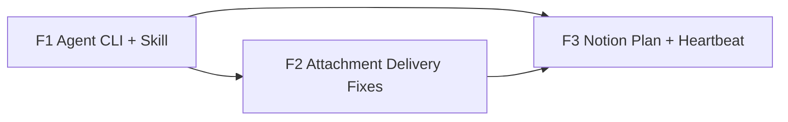

# C3 Batch Architecture Plan

## Feature Queue

| Feature | Title | Depends On | Ready |
|---|---|---|---|
| F1 | Agent CLI 发送工具与 Agent Skill 包装 | - | yes |
| F2 | 统一附件投递修复与真实渠道验收 | F1 | yes |
| F3 | Notion 计划通读取与心跳提醒改造 | F1, F2 | yes |

## Architecture Impact

### CLI Boundary

`hypo-agent send` becomes a stable programmatic surface. It accepts text, images, files, JSON files, and stdin JSON, validates token input, supports `--dry-run`, defaults to HYX and all enabled outbound channels, and emits either pretty text or JSON.

### Outbound Send Service

The CLI should call a shared outbound service rather than duplicating channel logic. The service normalizes local paths into attachments, separates image attachments from ordinary files, enforces size/capability checks, dispatches to enabled channels, and returns per-channel `DeliveryResult` payloads.

### Channel Delivery

QQ Bot, Weixin, and Feishu already expose attachment capability declarations. C3 should make the behavior match the declaration: one intended image should produce one image send per channel, ordinary files should be sent when supported, and unsupported or oversized payloads should produce explicit recovery details.

### Agent Skill Wrappers

Claude, Codex, and OpenCode wrappers should not contain secrets. They should explain how to call the local CLI and expose a simple `send_to_hyx` workflow for text, images, files, dry-run, and smoke checks.

### Notion Plan Source

The new Notion reader should treat `HYX的计划通` as a page tree, not a todo database. It locates the current semester (`研一下`), the current month child page, and today's heading, then extracts item blocks with completion state and important rich-text annotations.

### Heartbeat

Heartbeat should consume the plan summary as a snapshot/event source. It should report completion rate, done/undone items, and important red/bold items, while keeping Notion access read-only.

### Acceptance Side Effects

Final acceptance is explicitly allowed to perform real external effects with guardrails: `[C3-SMOKE]` prefix, one text/image/file per channel, real Notion read-only smoke, service restart, and CLI completion report to HYX.
