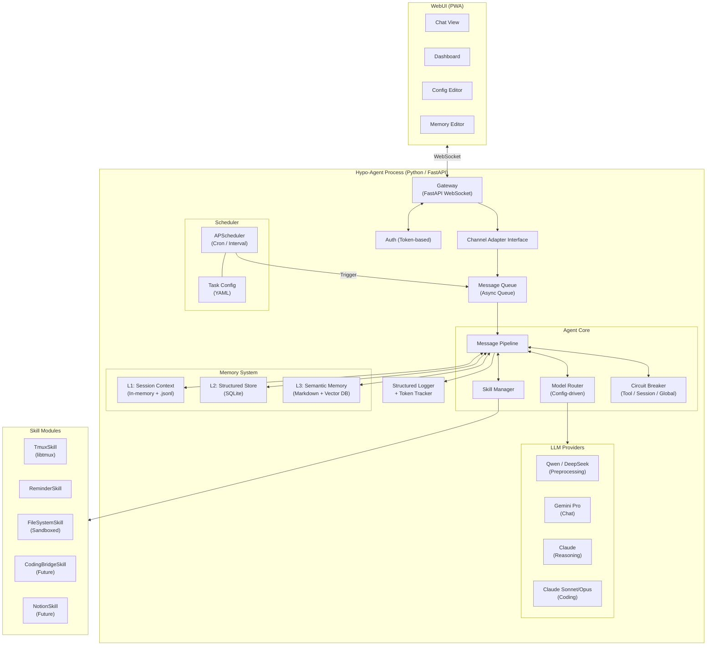
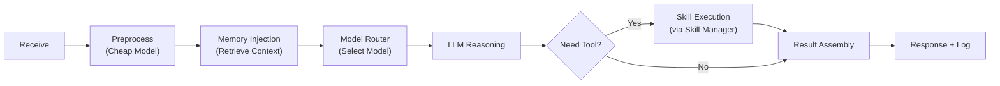
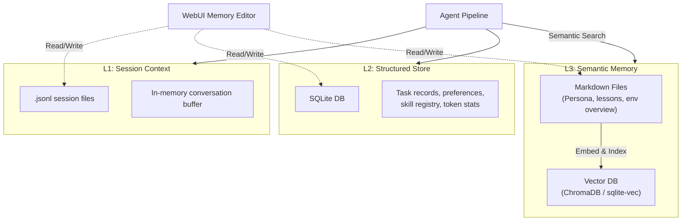
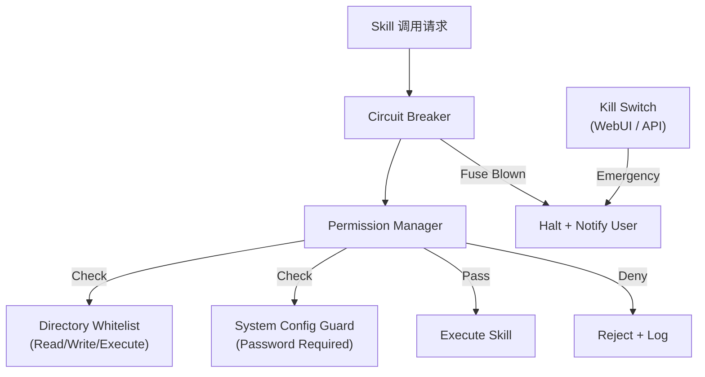
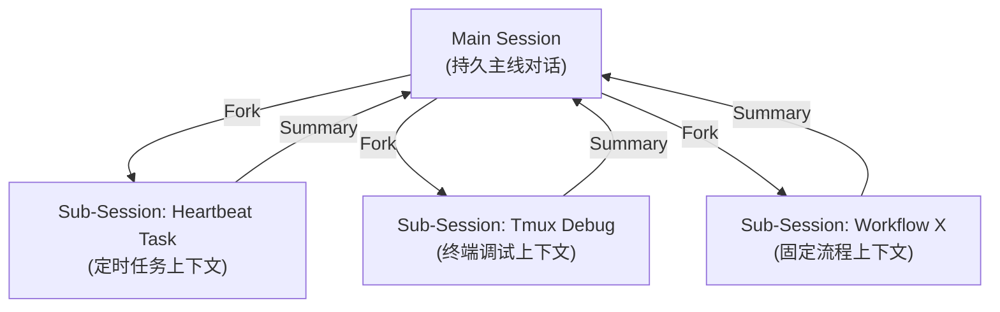
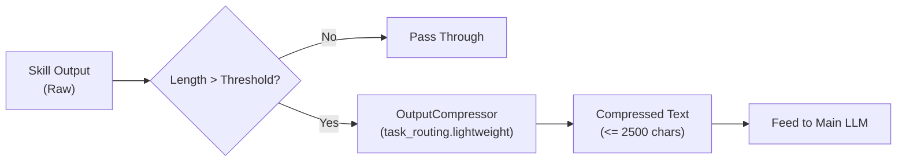

# 3. 架构设计

### 3.0 架构总览

Hypo-Agent 参考 OpenClaw 的单网关模式，但做了以下简化与增强：

- 简化鉴权（单用户，无复杂设备配对）
- 增强记忆（三层分层 + 用户可编辑）
- 增加多模型路由器（配置驱动的任务-模型映射）
- 增加分层熔断机制
- 技术栈从 Node.js 转为 Python (FastAPI)



### 3.1 Gateway 层

| 属性 | 设计 |
| --- | --- |
| 服务器 | FastAPI + WebSocket，长驻进程运行在 Genesis |
| 鉴权 | 简化为 Token-based Auth（单用户无需设备配对） |
| 消息格式 | 统一的内部消息结构（含 text / image / file / audio 独立字段） |
| 适配器 | 抽象 `ChannelAdapter` 接口，V1 实现 `WebUIAdapter`，后续可插入 `FeishuAdapter` / `QQAdapter` |

**相对 OpenClaw 的简化**：去掉了复杂的设备配对、challenge 签名、TypeBox 验证等重量机制。单用户场景下，一个 Token 足以保障安全。

### 3.2 Agent Core

Agent Core 是整个系统的“大脑”，包含四个核心组件：

**① Message Pipeline（消息管线）**

一条消息的完整流转：



- **Preprocess**：用廉价模型对消息进行意图分类、提取关键实体、判断是否需要调用工具。
- **Slash Commands Pre-dispatch（M6）**：若用户消息以 `/` 开头且命中内置指令（如 `/model status`、`/token`、`/kill`），直接在 Pipeline 内处理并返回，跳过 LLM 调用（零 token）。
- **Memory Injection**：根据当前上下文从三层记忆中检索相关信息，注入到 Prompt 中。
- **LLM Reasoning**：由 Model Router 选定的模型执行推理。
- **Skill Execution**：如果 LLM 返回工具调用请求，通过 Skill Manager 执行，结果回馈给 LLM 继续推理（标准的 ReAct 循环）。

**② Model Router（多模型路由器）**

- 配置文件驱动（`models.yaml`），定义 `task_type → model` 的映射规则。
- Pipeline 的 Preprocess 阶段识别出任务类型后，Router 自动选择对应模型。
- 每次模型调用记录 `token_usage + latency_ms` 到 L2（SQLite），用于 `/model status` 与 `/token*` 统计。
- 提供 `/model status` 指令查看当前模型分配与用量。
- **相对 OpenClaw 的增强**：OpenClaw 通常只配置单一模型，Hypo-Agent 的多模型路由是核心差异化特性。

**③ Skill Manager（技能管理器）**

- 维护已注册的 Skill 列表，负责 Skill 的加载、权限校验和调用分发。
- 每个 Skill 继承 `BaseSkill` 接口，声明自己的名称、描述、所需权限和可用工具列表。
- LLM 的工具调用请求统一经过 Skill Manager 分发，且受 Circuit Breaker 监控。

**④ Circuit Breaker（分层熔断器）**

- 包裹在 Skill Manager 外层，监控每次工具/Skill 调用。
- 三层逻辑：工具级（3次失败禁用）→ 会话级（累计 5 次暂停）→ 全局 Kill Switch。
- **相对 OpenClaw 的增强**：OpenClaw 无内置熔断机制，这是 Hypo-Agent 的安全红线。

### 3.3 三层记忆系统



| 层级 | 存储 | 内容 | 检索方式 |
| --- | --- | --- | --- |
| L1 会话 | 内存 + .json | 当前对话上下文 | 直接读取 |
| L2 结构化 | SQLite | 任务记录、偏好 KV、Token 统计、Skill 注册表 | SQL 查询 |
| L3 语义 | Markdown + 向量 DB | 人设、经验教训、环境概述、历史摘要 | 向量相似度 + 关键字 |

**所有层级的数据均可通过 WebUI 或直接编辑文件进行修改。**

**相对 OpenClaw 的增强**：OpenClaw 为双层（.jsonl + SQLite/Markdown），Hypo-Agent 拆分为三层，将结构化数据（SQLite）和语义记忆（Markdown + Vector）明确分离，职责更清晰。

### 3.4 Scheduler（定时调度器）

- 基于 APScheduler，支持 Cron 表达式和固定间隔触发。
- 定时任务配置在 `tasks.yaml` 中，用户可通过 WebUI 编辑。
- 触发时将任务以内部消息格式插入 Message Queue，与用户消息使用同一套 Pipeline 处理。
- **V1 采用串行队列**：Heartbeat 任务与用户对话排队执行，避免并发复杂性。
- **M8 更新**：
  - 调度器与 Pipeline 通过中心 `asyncio.Queue`（`reminder_trigger` / `heartbeat_trigger`）集成；
  - APScheduler 使用 MemoryJobStore，启动时由 L2 `reminders` 表重建 active 任务；
  - Heartbeat 触发链为“代码预检 -> lightweight 模型综合判断 -> 异常才通知（正常静默）”。
- **M9 更新（Heartbeat + Email Scanner）**：
  - 新增 `HeartbeatService`，独立于 reminder heartbeat precheck，支持事件源聚合（`register_event_source`）与漏网提醒兜底（`list_overdue_pending_reminders`）；
  - `tasks.yaml` 新增 `heartbeat` 与 `email_scan` 的 interval 配置，应用启动时统一注册 interval jobs；
  - 新增 `email_scan_trigger` 事件类型，沿用中心 `EventQueue -> ChatPipeline._event_to_message -> WebSocket` 主动推送通路；
  - 默认门禁为测试模式 smoke：`bash test_run.sh` + `HYPO_TEST_MODE=1 uv run python scripts/agent_cli.py --port 8766 smoke`，用于验收主动消息 `message_tag` 链路完整性，且避免污染生产数据或触发 QQ 通道。

**相对 OpenClaw 的简化**：OpenClaw 支持 Webhook、邮件触发、语音唤醒等多种激活方式，Hypo-Agent V1 仅保留 Cron 触发，保持简单。

### 3.5 Skill 系统

每个 Skill 继承 `BaseSkill` 接口：

```
class BaseSkill:
    name: str                    # 技能名称
    description: str             # 描述（会被注入 LLM 的 system prompt）
    required_permissions: list   # 所需权限声明
    tools: list[Tool]            # 可用工具列表

    async def execute(tool_name, params) -> Result
```

**M5 内置 Skills**：

| Skill | 职责 | 权限 |
| --- | --- | --- |
| **TmuxSkill** | 在 tmux 会话中执行命令，支持超时与输出截断保护 | `required_permissions=[]`（M5 暂不做 PM 校验） |
| **CodeRunSkill** | 将 Python / shell 代码写入临时文件后执行，优先使用 bwrap 沙箱，缺失时 fallback 直执并告警 | `required_permissions=[]`（通过 PM 白名单生成 bwrap rw 绑定） |
| **FileSystemSkill** | 智能文件读取/写入/目录列表 + 目录树索引（`directory_index.yaml`） | `required_permissions=["filesystem"]` |
| **EmailScannerSkill（M9）** | 多账户 IMAP 扫描、三层分类、摘要、附件落盘、定时扫描入队 | `required_permissions=[]`（依赖白名单限制附件目录） |

**M5 Tool Calling 执行路径**：

1. Router 以 `tools` 参数调用 LLM（LiteLLM function calling）
2. Pipeline 进入 ReAct 循环，解析 `tool_calls`
3. SkillManager 统一分发工具调用，执行链路为 `CircuitBreaker.can_execute -> PermissionManager.check(按需) -> skill.execute -> record_success/failure`
4. 工具结果回灌到 ReAct messages，直到模型结束或触发最大轮次限制

**后期扩展**：

- `CodingBridgeSkill`：对接 Hypo-Coder / Codex / Claude Code
- `NotionSkill`：接入 Notion API

### 3.6 安全架构



- **Permission Manager**：根据 Skill 声明的权限和全局安全策略（`security.yaml`）进行校验。
- **Directory Whitelist**：配置文件使用 `rules + default_policy` schema（白名单外默认只读）。
- **System Config Guard**：修改系统配置类操作需用户显式确认 + 密码。

M5 实际落地细节：

1. `PermissionManager.check_permission(path, operation)` 使用 `Path.resolve(strict=False)`，跟随 symlink 并消除 `..`，防止路径穿越。
2. `CodeRunSkill` 通过 bwrap 构建隔离执行环境：
   - `--ro-bind / /`
   - 对白名单中具 `write` 权限目录添加 `--bind <path> <path>`
   - `/tmp/hypo-agent-sandbox` 固定 rw
   - `--dev /dev --proc /proc --unshare-all --share-net`
3. bwrap 缺失时不阻塞：记录 `code_run.bwrap.fallback` 警告并退回 `bash -lc` 直接执行。
4. 观测事件已接入：
   - `permission.check.allowed` / `permission.check.denied`
   - `fs.read` / `fs.write` / `fs.list` / `fs.scan` / `fs.index.update`
   - `code_run.bwrap.exec` / `code_run.bwrap.fallback`

### 3.7 WebUI 架构

| 页面 | 职责 | 数据源 |
| --- | --- | --- |
| Chat View | 对话界面，Markdown 渲染 + 代码高亮 + 富媒体 | WebSocket 实时流 |
| Dashboard | 运行状态、Token 统计、活跃 Skill、最近任务 | REST API 轮询 |
| Config Editor | 模型路由、Skill 配置、安全策略、定时任务编辑 | REST API |
| Memory Editor | 三层记忆的浏览、搜索、编辑 | REST API |

前端与后端通信：

- 对话流：WebSocket（实时双向）
- 配置/记忆/仪表盘：REST API（读写操作）

### 3.8 与 OpenClaw 的关键差异对比

| 维度 | OpenClaw | Hypo-Agent |
| --- | --- | --- |
| 技术栈 | Node.js / TypeScript | Python / FastAPI |
| 模型路由 | 单模型为主 | 多模型配置驱动路由 |
| 记忆 | 双层（.jsonl + SQLite/MD） | 三层（Session + SQLite + MD/Vector） |
| 鉴权 | 设备配对 + Challenge 签名 | Token-based（单用户简化） |
| 安全 | 无内置熔断 | 三层熔断 + 权限沙箱 + Kill Switch |
| 前端 | 三方消息平台为主 | 自建 WebUI（Chat + Dashboard + Config + Memory） |
| 调度 | Cron + Webhook + 邮件 + 语音 | V1 仅 Cron，保持简单 |

### 3.9 会话管理（Session Model）

*引入自旧系统的 Thread ID / Task ID 隔离机制，增加主/副会话设计。*

L1 会话记忆采用**主会话 + 副会话**模型：



- **主会话（Main Session）**：用户与 Agent 的持久对话主线，始终存在，承载日常交流和上下文连续性。WebUI 的 Chat View 默认展示主会话。
- **副会话（Sub-Session）**：由特定任务 Fork 出的独立上下文，拥有独立的 session_id 和消息缓冲区。典型场景：
    - Heartbeat 定时任务触发时自动创建副会话
    - WorkflowSkill 执行固定流程时创建副会话
    - 用户主动开启一个专项任务（如"帮我调试这个项目"）
- **回流机制**：副会话结束时，用小模型生成摘要，回流到主会话的上下文中（而非把所有细节灌回去）。
- **WebUI 展示**：主会话为默认视图，副会话以可折叠的侧边栏/标签页形式展示（类似旧系统设计的"单收件箱 + 可折叠后台任务"）。

**M8 Reminder 特例（当前生效）**：
- 定时提醒与 Heartbeat 通知统一写入主会话（`session_id="main"`），不创建独立副会话；
- 用户离线时事件仍落盘到 L1 `.jsonl`，上线后可在主会话历史中看到提醒消息。

### 3.10 OutputCompressor（工具输出压缩中间件）

*M6 将旧命名 Error Parser Chain 统一为 OutputCompressor，并扩展为通用工具输出压缩器。*

当 Skill 返回内容过长时，Pipeline 在 ReAct 工具回灌前自动触发压缩：



- 触发阈值：`len(output) > 2500` 字符。
- 路由模型：`task_routing.lightweight`（当前为 `DeepseekV3_2`）。
- 压缩模式：
  - `<=128K`：单次压缩。
  - `>128K`：按约 `80K` 分段压缩并最多迭代 3 轮。
- 原始输出保留：structlog 事件 + 内存最近 10 条缓存（便于追问细节）。
- 输出标记：`[📦 Output compressed from X → Y chars. Original saved to logs. Ask me for details.]`
- **核心价值**：限制工具输出在可控窗口内，降低 ReAct 上下文膨胀和 Token 成本。

### 3.11 Memory GC（记忆垃圾回收）

*引入自旧系统的"后台闲时 GC 进程"设计。*

作为 Heartbeat 的一个内置定时任务（如每天凌晨执行）：

1. **扫描** L1 已结束的副会话日志和过期的主会话历史。
2. **提取** 有价值的信息（踩坑记录、关键决策、用户偏好变更等），用小模型压缩为结构化摘要。
3. **写入** L3 语义记忆（Markdown 文件），并触发向量索引更新。
4. **清理** 已处理的 L1 历史文件，保持短期记忆精简。

这确保 Agent 的长期记忆不断积累有价值的知识，而不是无限膨胀的原始对话记录。

### 3.12 SkillOutput 标准契约

*引入自旧系统的 `SkillOutput` 设计，去掉 routing_directive，保留结构化返回。*

所有 Skill 的返回值统一为 `SkillOutput` 结构：

```python
@dataclass
class SkillOutput:
    status: str          # "success" | "error" | "partial" | "timeout"
    result: Any          # 实际返回内容（文本、文件路径、结构化数据等）
    error_info: str      # 错误信息（status != success 时填写）
    metadata: dict       # 附加元数据（执行耗时、Token 消耗等）
```

- `status` 用于 Circuit Breaker 的错误计数判定。
- `metadata` 用于日志和可观测性仪表盘。
- `error_info` 用于 Error Parser Chain 的输入。
- 统一的返回结构使得所有 Skill 对 Pipeline 来说行为一致，降低集成成本。

### 3.13 WorkflowSkill（可注册固定流程引擎）

*将旧系统的 DAG 状态机改造为可插拔的 Skill，通过配置注册固定流程。*

WorkflowSkill 是一个特殊的 Skill，内部维护一个轻量状态机，按配置文件定义的步骤顺序执行：

```yaml
# workflows/coding_check.yaml
name: coding_check
description: "拉代码 → 跑测试 → 分析错误 → 报告"
steps:
  - name: pull_code
    skill: TmuxSkill
    command: "cd project_dir && git pull"
    on_error: abort
  - name: run_tests
    skill: TmuxSkill
    command: "cd project_dir && pytest"
    on_error: continue
  - name: analyze
    skill: ErrorParserChain
    input_from: run_tests.output
  - name: report
    action: reply_to_user
    template: "项目 project_dir 检查完毕：\nanalyze.output"
```

- 每个 Workflow 通过 YAML 配置注册，放在 `workflows/` 目录下，启动时自动加载。
- Workflow 执行时自动创建副会话（3.9），不污染主对话。
- 每一步的 `on_error` 控制流转：`abort`（终止）、`continue`（跳过继续）、`retry`（重试）。
- LLM 可以通过 Skill Manager 调用已注册的 Workflow，也可以由 Heartbeat 定时触发。
- **与纯 ReAct 的分工**：日常对话和灵活任务用 ReAct；固定、可重复、需要确定性的多步流程用 WorkflowSkill。

### 3.14 当前仓库目录（M0 基线）

当前代码采用 `src/hypo_agent/` package layout（不是 flat layout）。

- 导入根：`hypo_agent`
- 示例导入：`from hypo_agent.models import Message`

```text
hypo-agent/
├── config/                        # YAML 配置
│   ├── models.yaml
│   ├── skills.yaml
│   ├── security.yaml
│   ├── tasks.yaml
│   └── persona.yaml
├── workflows/                     # Workflow 配置
├── memory/
│   ├── sessions/
│   ├── knowledge/
│   └── hypo.db
├── src/
│   └── hypo_agent/
│       ├── __init__.py
│       ├── models.py              # Pydantic 模型定义
│       ├── gateway/
│       │   └── __init__.py
│       ├── core/
│       │   ├── __init__.py
│       │   └── logging.py
│       ├── memory/
│       │   └── __init__.py
│       ├── skills/
│       │   └── __init__.py
│       ├── scheduler/
│       │   └── __init__.py
│       └── security/
│           └── __init__.py
├── web/                           # M1 将初始化 Vue 3 + Vite + TS
├── tests/
│   ├── conftest.py
│   └── test_models_serialization.py
├── logs/
├── pyproject.toml
└── environment.yml
```

说明：M0 已完成骨架与模型层，M1 主要在 `src/hypo_agent/gateway/` 与 `web/` 目录推进功能实现。

### 3.15 M0 已定义数据模型清单（5 个核心 Pydantic 模型）

模型文件：`src/hypo_agent/models.py`

| 模型 | 职责 | 关键字段 |
| --- | --- | --- |
| `Message` | WebSocket 与内部消息统一载体 | `text/image/file/audio`, `sender`, `timestamp`, `session_id` |
| `SkillOutput` | Skill 统一返回契约 | `status`, `result`, `error_info`, `metadata` |
| `ModelConfig` | 模型路由配置结构 | `default_model`, `models`, `task_type_to_model` |
| `SecurityConfig` | 安全配置结构 | `directory_whitelist`, `circuit_breaker` |
| `PersonaConfig` | 助手人设配置结构 | `name`, `aliases`, `personality`, `speaking_style` |

补充：`SecurityConfig` 在实现中由两个子模型组成：`DirectoryWhitelist` 与 `CircuitBreakerConfig`。

### 3.16 M7a 增补（Chat View + UI Foundation）

M7a 在不破坏既有 WebSocket 协议行为的前提下，补齐了 Chat View 渲染能力与 UI 基础架构，并引入后续多渠道扩展所需的内部抽象层。

#### 3.16.1 Gateway API 增补

新增 REST 端点：

| Method | Path | 用途 |
| --- | --- | --- |
| `GET` | `/api/compressed/{cache_id}` | 从 `OutputCompressor` 内存缓存中取回原始工具输出 |
| `GET` | `/api/files?path=...` | 受 Token + `PermissionManager` 白名单保护的文件内容读取 |

其中 `/api/files` 需要通过 `Authorization: Bearer <token>`（或 `?token=` fallback）鉴权，并执行 `read` 权限校验。

#### 3.16.2 WebSocket 事件协议（向后兼容）

现有事件保持不变：

- `assistant_chunk`
- `assistant_done`
- `tool_call_start`
- `tool_call_result`

M7a 增补点：

- `tool_call_result` 在发生压缩时携带可选字段：
  - `compressed_meta = { cache_id, original_chars, compressed_chars }`
- 统一错误事件 envelope：
  - `{"type":"error","code":"...","message":"...","retryable":bool,"session_id":"..."}`

#### 3.16.3 Core 出口抽象（RichResponse + ChannelAdapter）

新增：

- `core/rich_response.py`: `RichResponse(text, compressed_meta, tool_calls, attachments)`
- `core/channel_adapter.py`: `ChannelAdapter` Protocol + `WebUIAdapter`

`ChatPipeline` 内部先构造 `RichResponse`，再由 `WebUIAdapter.format()` 转换为当前 WebSocket 消息。该设计保证了当前 WebUI 协议兼容，同时为后续多渠道（非 WebUI）适配预留统一出口。

#### 3.16.4 L2 结构化存储增补：tool_invocations

SQLite 新增 `tool_invocations` 表（含 session/tool/status/duration/error/result_preview），并建立会话、工具名、时间索引。`SkillManager.invoke()` 在 success/error/timeout/blocked 分支均会写入记录。

#### 3.16.5 前端 Chat 渲染组件体系

Chat 消息渲染从单体视图拆分为组件树：

- `MessageBubble`
- `TextMessage`
- `CodeBlock`
- `MarkdownPreview`
- `MediaMessage`
- `CompressedMessage`
- `ToolCallMessage`
- `FileAttachment`

同时新增统一 `markdownRenderer`（GFM table/task list、KaTeX、Mermaid 懒加载、代码块行号/复制/语言标签），并在 `useChatSocket` 中支持指数退避重连（1s→2s→4s→8s→16s→30s）。

### 3.17 M7b 增补（Dashboard + Config Editor + Memory Editor）

M7b 在 M7a 基础上补齐了功能页闭环，并优先修复了 Session 切换后工具中间消息不可恢复的问题。

#### 3.17.1 Tool Invocation 持久化与回放

- `tool_invocations` 表升级为 M7b 契约字段：
  - `session_id`, `tool_name`, `skill_name`, `params_json`, `status`
  - `result_summary`（500 字符摘要）
  - `duration_ms`, `error_info`
  - `compressed_meta_json`（`cache_id/original_chars/compressed_chars`）
  - `created_at`
- `SkillManager.invoke()` 在 `success/error/timeout/blocked` 全分支写入记录，并将 `invocation_id` 回填到 `SkillOutput.metadata`。
- `ChatPipeline` 在 OutputCompressor 产生压缩元信息后，回写 `compressed_meta_json` 到对应 invocation 记录。
- 新增 `GET /api/sessions/{session_id}/tool-invocations`（Token 鉴权）供前端恢复工具调用历史。
- ChatView 切换会话时并行加载 `messages + tool-invocations`，按时间线交错重建 `tool_call_start/tool_call_result`。

#### 3.17.2 Dashboard API（REST + Token）

新增 `/api/dashboard/*`：

- `GET /api/dashboard/status`：`uptime/session_count/kill_switch/bwrap_available`
- `GET /api/dashboard/token-stats?days=7`：按模型按天聚合 token
- `GET /api/dashboard/latency-stats?days=7`：按天输出 `p50/p95/p99`（优先 `token_usage.latency_ms`，空时回退 `tool_invocations.duration_ms`）
- `GET /api/dashboard/recent-tasks?limit=20`：最近工具调用
- `GET /api/dashboard/skills`：技能列表与熔断状态

#### 3.17.3 Config API 与热重载

新增 `/api/config/*`：

- `GET /api/config/files`
- `GET /api/config/{filename}`
- `PUT /api/config/{filename}`

可编辑文件限定为：
`models.yaml`, `skills.yaml`, `security.yaml`, `persona.yaml`, `tasks.yaml`。

`PUT` 流程：
1. 解析 YAML
2. 按文件类型做 Pydantic 校验
3. 写盘
4. 触发 `reload_config()` 热重载

`reload_config()` 会更新：

- `PermissionManager`
- `CircuitBreaker`
- `SkillManager`（含 skills.yaml 开关）
- `ChatPipeline`（重建后接入新 `ModelRouter` / `SlashCommandHandler` / `OutputCompressor`）

#### 3.17.4 Memory API（L1/L2/L3）

新增 `/api/memory/*` 与会话导出接口：

- `GET /api/memory/tables`
- `GET /api/memory/tables/{name}?page=1&size=50`
- `PUT /api/memory/tables/{name}/{id}`（后端可写白名单控制，当前 `preferences` 可写）
- `GET /api/memory/files`
- `GET /api/memory/files/{path}`
- `PUT /api/memory/files/{path}`
- `GET /api/sessions/{id}/export?format=json|markdown`
- `DELETE /api/sessions/{id}`（会话删除）

其中 `memory/files` 访问限定在 `memory/knowledge` 根目录内，防止路径穿越。

#### 3.17.5 WebUI 功能页

- `DashboardView.vue`：状态卡片 + Token 图 + Latency 图 + Skills 状态 + Recent Tasks，5s 轮询。
- `ConfigView.vue`：左侧文件树 + 右侧 `Form/YAML` 双 Tab，YAML 编辑支持 Monaco（失败自动 fallback textarea）。
- `MemoryView.vue`：L1 会话管理、L2 SQLite 浏览、L3 知识文件编辑。
- `App.vue` 导航已从 Chat 单页升级为 `💬 / 📊 / ⚙️ / 🧠` 多页面切换，保持 M7a 三断点响应式行为。
